# Quick overview of the performance of 1st Sat2Graph model on Omani Cities (mapbox+OSM) dataset

> To see the original README.md of this repo, click [here](./README.original.md).

## 1) Basic information  
   1) Architecture: Sat2Graph  
   2) Dataset: Omani Cities, satellite imageries from Mapbox, road graph networks from OpenStreetMap. We have 161 regions (train:val:test \= 0.7:0.1:0.2). But, during training, only 0.35 out of 0.7 were used because of memory issue (from the author’s original training script).  
   3) Total training duration: about 48 hours (224200 steps) on Quadro RTX 4000  
   4) Best model: step 174000, test\_loss 0.579  
   5) Tile size: 352x352  
## 2) Sample results from some tiles of some regions in the validation data

| No | Satellite imagery | GT of Semantic Seg | Predicted Graph | Predicted Semantic Seg |
| ----- | :---- | :---- | :---- | :---- |
| 1 | 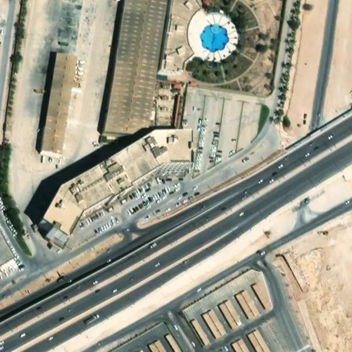 |  |  |  |
| 2 | 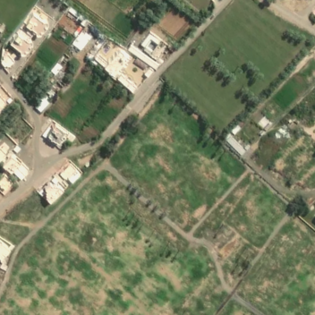 |  | 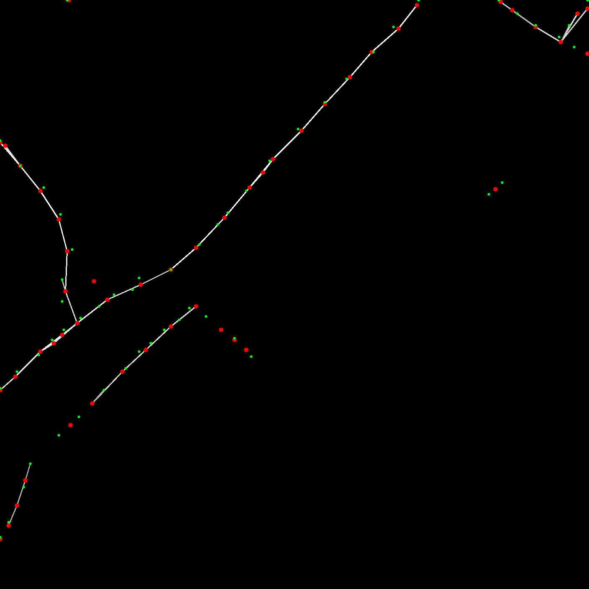 | 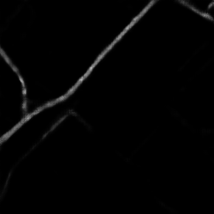 |
| 3 | 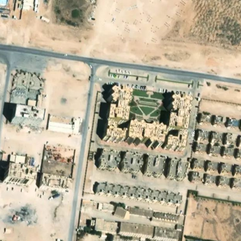 | 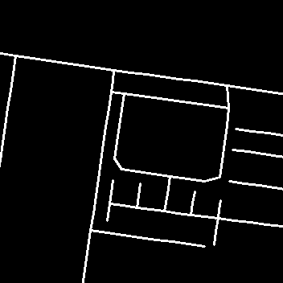 |  | 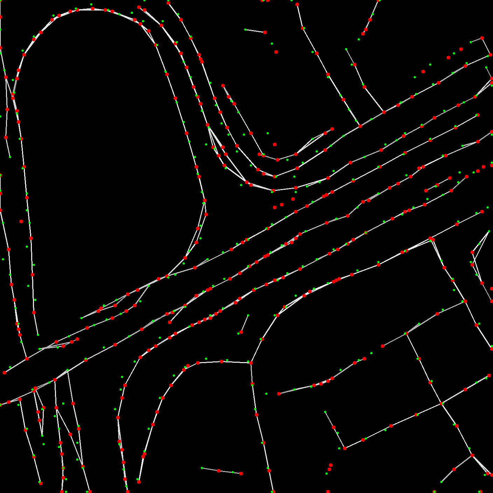 |
| 4 | 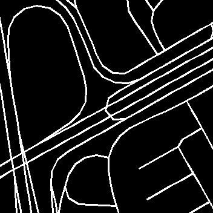 |  |  |  |
| 5 |  |  | 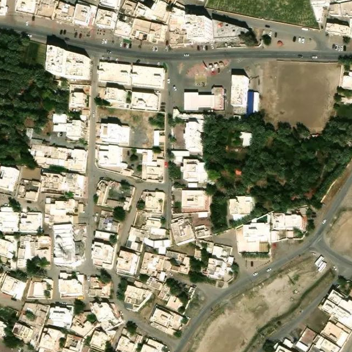 |  |
| 6 |  | 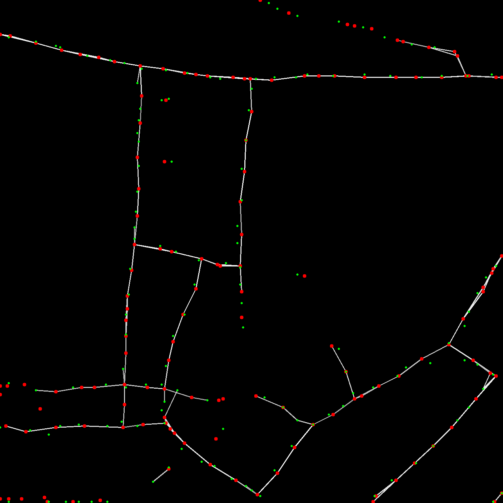 | 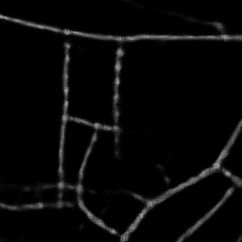 | 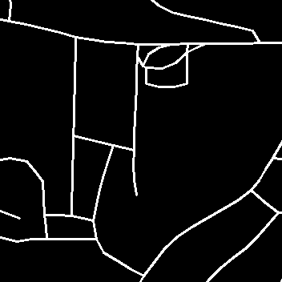 |
| 7 |  | 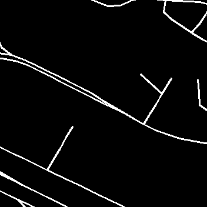 | 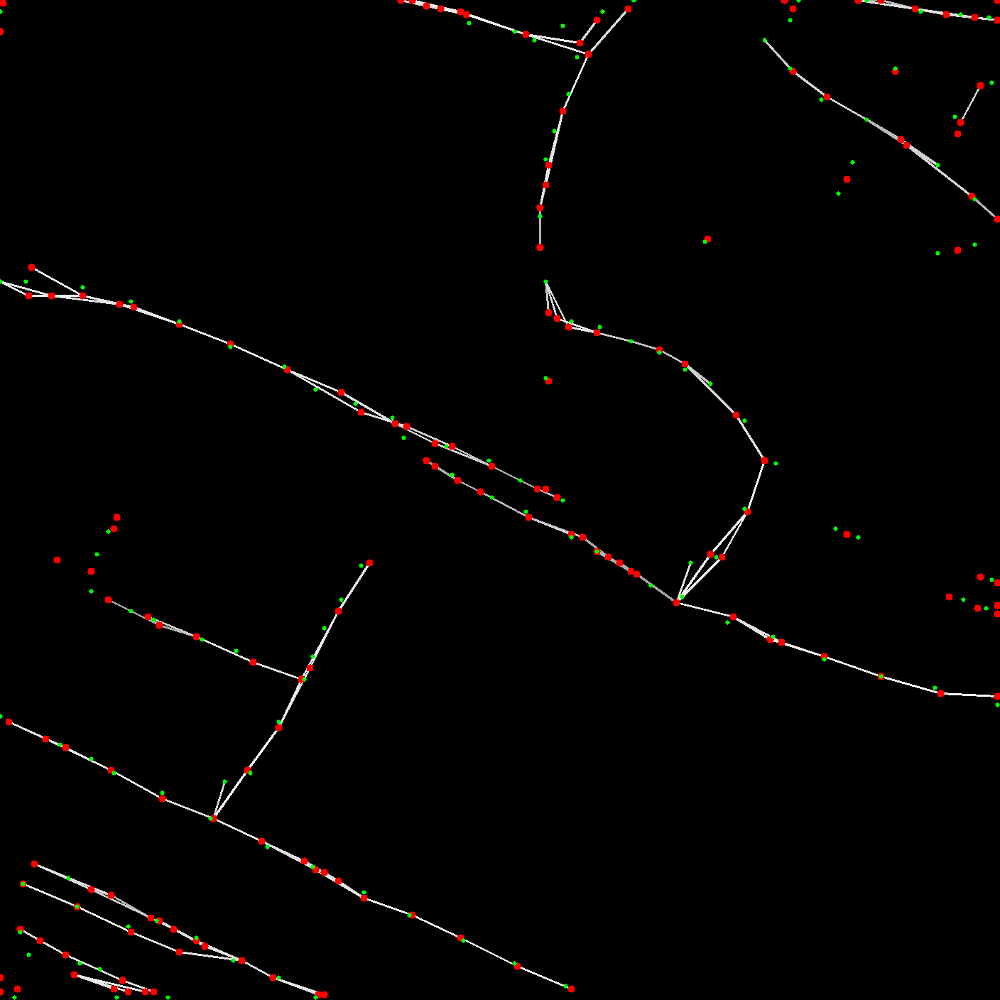 | 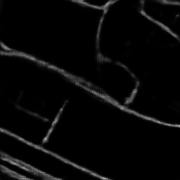 |
| 8 |  | 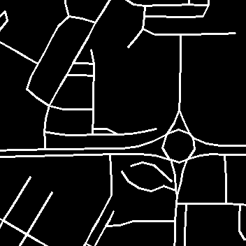 | 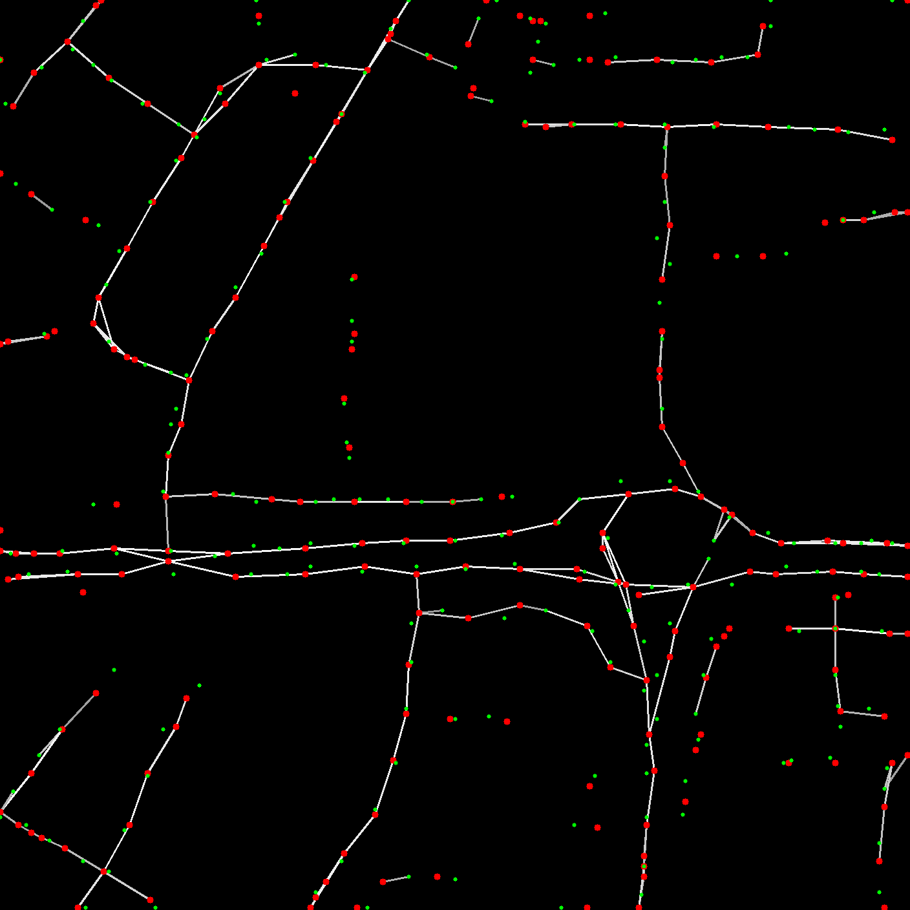 | 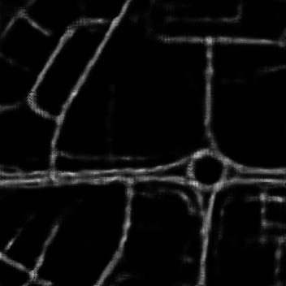 |

## 3) Qualitative Analysis on the prediction results  
   1) The model performs well detecting roads, even those that are missed to be annotated by humans. See segmentation GT in (4) and (6), we found some roads are not annotated in the GT, but our model is able to correctly detect that. In (7) and (8), we see that the model is barely can detect unannotated roads. Maybe because Sat2Graph is not just using simple segmentation for doing graph prediction, but it also accounts the road network topology and connectivity so is robust even though there are several missing and misaligned roads in the ground truth.  
   2) The model still has some false negatives.  
## 4) Possible action items  
   1) Solve memory limitation issue, so we can train the model using full data/higher number of data  
   2) Gather more data from other cities, in hope that the model can better generalize and less affected by missing roads  
   3) Filter out training images with incorrect annotations (high effort)  
   4) Add road networks dataset from Fahud
